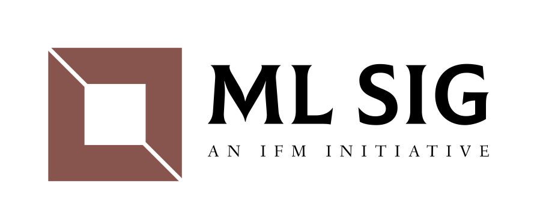

# ml-sig
Welcome to IfM's Machine Learning Special Interest Group! Join us [here](https://forms.office.com/Pages/ResponsePage.aspx?id=RQSlSfq9eUut41R7TzmG6aqj9-yAHI5Bt3EG4ZSAWylUQUlBODZIUVVMOUFMOERWSEtTU1pDRVZRTC4u)!

We'll collate recent presentations/tutorials/documents pertaining to our group here. 

Recent Meetups
1. [NeurIPS 2020 Sharing Session](https://universityofcambridgecloud-my.sharepoint.com/:p:/g/personal/sm2410_cam_ac_uk/EaBDExTxkslCsgWm6Grz0UIB0tatNwNb-8MbAiSWPGij8A?e=JH94nC) - Please request access from the maintainers. Open only to cam.ac.uk users.

Useful Tutorials
1. [Deep Implicit Layers](resources/deep-implicit-layers.MD)
2. [Calculus for Machine Learning](resources/calculus-ml.MD)
3. [Graph Mining](resources/graph-mining.MD)

Other Virtual ML Communities around the world:
1. [Trustworthy ML](https://www.trustworthyml.org/)
2. [ML Collective](http://mlcollective.org/neurips-2020-open-collab-social/)

Maintainers:
1. [Edward Elson Kosasih](https://github.com/edwardelson)
2. [Stephen Mak](https://github.com/StephenMak12)
